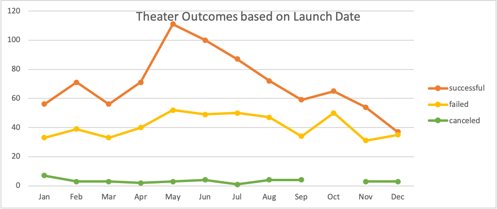
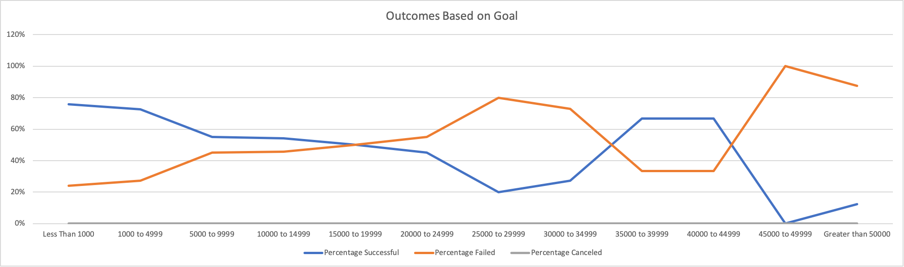

# An Analysis of Kickstarter Campaigns

## Overview of Project

### Purpose

The success or failure of a Kickstarter campaign could be linked to different parameters. Using the Kickstarter dataset,  that provides data of Campaigns Launched between 2009 and 2017, and from different categories such as Technology, Film, Publishing, Food, etc.  This project aims to Analyze the outcome of Theater and Plays campaigns based on their launch date and funding goals. 

## Analysis and Challenges

### Analysis of Outcomes Based on Launch Date

Converting the unix timestamps into a format date that is readable, and inserting a pivot table that uses “Parent Category” and “Years” as a filter, we were able to produce a pivot chart for the Analysis of the Outcomes (Successful, Failed or Canceled) of all the Kickstarter Theater Campaigns launched between 2009 and 2017, illustrated based on the  Launch Date and grouped by months, see Fig. 1 below for results. 

*Fig. 1 Theater Outcomes Based on Launch Date.*

Additional Formulas used: 
YEAR()

### Analysis of Outcomes Based on Goals

Using the excel functions COUNTIFS(), we have counted the “Number Successful,” “Number Failed,” and “Number Canceled” columns, based on  the “goal” amount and the goal ranges in the Horizontal Axis below, as well as the Subcategory“ plays. The result is the Fig 2. shown below. 

*Fig. 2 Outcomes Based on Goal*

### Challenges and Difficulties Encountered

I did not encountered any difficulties, however, I could see how, if not understood correctly, there could be some confusion on how to read and filter the data provided, and to understand which Analysis are performed. For example, the dataset contains information about different campaigns Categories & Countries, if not read correctly, the wrong sample could be selected for the different outcomes, i.e. analyzing only the Theater Campaign in the US when the challenge is asking for all of the Theater Campaigns in the dataset. 

## Results

* What are two conclusions you can draw about the Outcomes based on Launch Date?

We have found that the most successful Theater campaigns were launched in May, June & July, being May the most effective one with a successful rate of 67%; 111 successful campaigns out of the 166 total launched that month. On the other hand, December presented the less favorable month to launch a campaign with a successful rate of 49%; out of the 75 campaigns launched, only 37 were successful. 

* What can you conclude about the Outcomes based on Goals?

Based on "Outcomes Based on Goals", we can conclude that there is a higher rate of success, 76 % rate of successs and 24% rate of failure, for Campaigns in the Theater Category - Subcategory Play, if the campaign goal is less than $1,000. 

* What are some limitations of this dataset?

Our dataset has extreme datapoint, therefore, some large values are driving the  distributions. For example, If when analyzing the “Outcomes Based on Goal” we say that all Goals with a successful rate of > 65% are most likely to be pledged, we would be providing an inaccurate analysis since we can see that: 

— If the Goal is less than 5,000 we get > 70% of success.
— If the Goal is between 5,000 and 34,999 we have between 55% and 27% of success.
— If the Goal is between 35,000 and 44,999 we have 67% chances of success. 

As we can observe, even for some datapoint with considerable larger amount of Goals there is a high rate of success. As a result, it’s challenging to provide advise based only on “Analysis of Outcomes Based on Goals” and “Analysis of Outcomes Based on Launch Date” without calculating the descriptive statistics, specially median and quartiles, to identify our outliers and have a more robust conclusion.

Also, we would need to perform other statistics analysis to validate if the sample size we have selected is representative of the population. 

* What are some other possible tables and/or graphs that we could create?

We could have created a “Descriptive Statistics” table to obtain the median and quartiles of our Analysis, as well as a Box Plot to visualize these robust statistics, and easily identify our outliers. 
 
